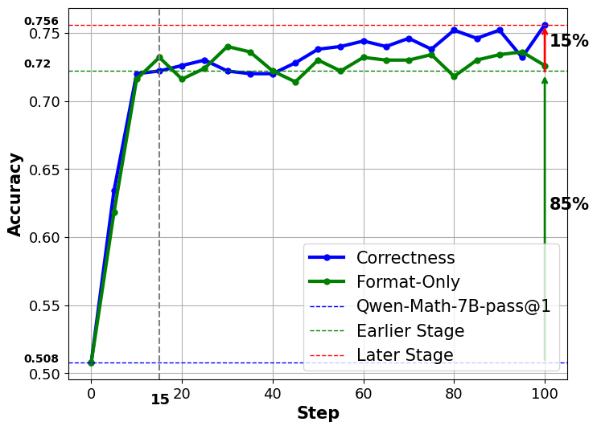

<div align="center">

# RL-Without-GT
## Reinforcement Learning Without Ground Truth


[](https://arxiv.org/abs/2505.19439) 

[//]: # ([![Hugging Face Collection]&#40;https://img.shields.io/badge/Models-fcd022?style=for-the-badge&logo=huggingface&logoColor=000&#41;]&#40;&#41;)

<div align="center" style="font-family: Arial, sans-serif;">
  <p>
    <a href="#updates" style="text-decoration: none; font-weight: bold;">🎉 Updates</a> •
    <a href="#links" style="text-decoration: none; font-weight: bold;">🔗 Links</a> •
    <a href="#tldr" style="text-decoration: none; font-weight: bold;">📖 TL;DR</a>
    <a href="#tldr" style="text-decoration: none; font-weight: bold;">🚀 Overview</a>
  </p>
  <p>
    <a href="#usage" style="text-decoration: none; font-weight: bold;">💻 Usage </a> •
    <a href="#citation" style="text-decoration: none; font-weight: bold;">🍊 Citation</a> •
    <a href="#acknowledgement" style="text-decoration: none; font-weight: bold;">🌻 Acknowledgement</a>
  </p>
</div>

</div>

## Updates

* 27/05/2025: 🎉 We release our first work with paper and codebase (models are coming soon).

## Links

*  **Surrogate Signals from Format and Length: Reinforcement Learning for Solving Mathematical Problems without Ground Truth Answers**
  * 📄 [Paper](https://arxiv.org/abs/2505.19439)


## TL;DR

In **RL-Without-GT**, we proposed a format-length surrogate reward strategy that enables training LLMs by **Reinforcement Learning(RL)** for math problem-solving **without ground truth(Without-GT)** answers, achieving **40.0%** accuracy on **AIME2024** with a **7B** model—outperforming standard GRPO.

## Overview

In **RL-Without-GT**, we delve into the utilization of format and length as surrogate signals to train LLMs for mathematical problem-solving, bypassing the need for traditional ground truth answers, it is a **Label Free** method. 

Our study shows that a reward function centered on format correctness alone can yield performance improvements comparable to the standard GRPO algorithm in this phase. Recognizing the limitations of format-only rewards, we incorporate length-based rewards. The resulting GRPO approach, leveraging format-length surrogate signals, not only matches but surpasses the performance of the standard GRPO algorithm relying on ground truth answers in certain scenarios, achieving 40.0% accuracy on AIME2024 with a 7B base model.

Performance across challenging mathematical benchmarks:

| Method         | Label Free                       | AIME2024        | MATH500         | AMC2023        | AVG.           |
|---------------|----------------------------------|------------------|------------------|----------------|----------------|
| Qwen-Math-7B  | <span style="color:red">-</span> | 16.7             | 50.8             | 42.2           | 36.6           |
| Qwen2.5-Math-7B-Instruct | <span style="color:red">✗</span> | 16.7             | 83.2             | 55.4           | 51.8           |
| LIMR-7B       | <span style="color:red">✗</span> | 23.3 (32.5*)     | 74.8 (78.0*)     | 60.2 (63.8*)   | 52.8 (58.1*)   |
| SimpleRL-Zero-7B | <span style="color:red">✗</span> | 26.7 (40.0*)     | 75.4 (80.2*)     | 57.8 (70.0*)   | 53.3 (63.4*)   |
| Oat-Zero-7B   | <span style="color:red">✗</span> | 40.0 (43.3*)     | 78.2 (80.0*)     | 61.5 (62.7*)   | 60.0 (62.0*)   |
| **Correctness (baseline)** | <span style="color:red">✗</span> | 26.7 / 26.7      | 74.6 / **73.0**  | 57.8 / **56.6**| 53.0 / 52.1     |
| **Format-Only** | <span style="color:red">✓</span> | 26.7 / 26.7      | 72.6 / 72.8      | 55.4 / 53.0    | 51.6 / 50.8     |
| **Format-Length** | <span style="color:red">✓</span> | **33.3 / 40.0**  | **76.8 / 73.0**  | **60.2 / 54.2**| **56.8 / 55.7** |

<sub>Note:Results are separated by a slash for DeepscaleR and MATH-train datasets (DeepscaleR first, MATH-train second). Results without * are evaluated in our environment ; * indicates results from the original paper.</sub>

### Insight

**The powerful base model is like an excellent student who has already mastered mathematical and logical reasoning skills, but performs poorly on the test paper, it simply needs to develop good answering habits to achieve outstanding results in exams — in other words, to unlock the capabilities it already possesses.**


<p align="center">
  
</p>
<p align="center">
  Accuracy curves on MATH500 benchmark 
</p>


During the initial **15** steps of RL training, the model predominantly focuses on learning the format of mathematical solutions. This early phase is crucial, contributing approximately **85%** of the MATH500 performance improvement during the entire RL training process.

## Usage

### Install

1.Follow the [verl-install](https://verl.readthedocs.io/en/latest/start/install.html) to get the docker images [vemlp-th2.4.0-cu124-vllm0.6.3-ray2.10-v0.0.2](https://hub.docker.com/layers/verlai/verl/vemlp-th2.4.0-cu124-vllm0.6.3-ray2.10-v0.0.2/images/sha256-f6b2de9c2632d4f6f16f216195fc8d2c91a3b1c352b6612ab300421b986cd033).

2.Launch the desired Docker image and attach into it:

```
docker pull verlai/verl:vemlp-th2.4.0-cu124-vllm0.6.3-ray2.10-v0.0.2

docker run -it --runtime=nvidia --gpus all --net=host --shm-size=10g \
  --cap-add=SYS_ADMIN -v $(pwd):/workspace --name verl_container \
  verlai/verl:vemlp-th2.4.0-cu124-vllm0.6.3-ray2.10-v0.0.2 bash

# enter container again
docker start -ai verl_container

```


### Data

1.Download and preprocess

- Download the train data [DeepscaleR](https://github.com/agentica-project/rllm/tree/main/rllm/data/train/math), move the data into folder [train_data](rl/verl/lib/src/src_data/train).

- Use the [download_data.py](rl/verl/lib/src/src_data/download_data.py)  to download the train data [Math-train](https://huggingface.co/datasets/EleutherAI/hendrycks_math), move the data into folder [train_data](rl/verl/lib/src/src_data/train).

- Download the test data **MATH500**, **AIME2024**, **AMC2023** from [deepscaleR](https://github.com/agentica-project/rllm/tree/main/rllm/data/test/math), move the data into folder [test_data](rl/verl/lib/src/src_data/test).

- select the func in [preprocess_dataset.py](rl/verl/lib/src/src_data/preprocess_dataset.py) to preprocess above dataset.


2.You can just use the data(`xxx.parquet`) in [qwen_template](rl/verl/lib/data/qwen_template), which have already been processed.


### Training

We provide startup scripts for VERL that support both single-node and multi-node setups, addressing the issue of Ray initialization failures caused by synchronization mismatches in cloud environments.

1.Define the `$DIR`(your work dir), `$train_data`(train dataset path), `$val_data`(val dataset path), `$MODEL_LOAD`(base model dir), `$CHECKPOINT_LOAD`(model parameter dir), `$CHECKPOINT_SAVE`(save the ckpt and evaluation result) depends on your environment in [run_train.sh](rl/verl/verl/scripts/run_train.sh), then run:
```
bash run_train.sh
```
Notice:
- There are some config parameters in [run_train.sh](rl/verl/verl/scripts/run_train.sh):
```
# <nnodes> <save_freq> <test_freq> <total_training_steps>
bash ./scripts/train/run_grpo_math_7b.sh 1 20 5 100

```
- Before starting the training, you need to login to your Weights & Biases (wandb) account.
```
pip install wandb 
wandb login <your wandb key>
```


2.You can define some detailed config in [run_grpo_math_7b.sh](rl/verl/verl/scripts/train/run_grpo_math_7b.sh) as shown below:

```
# The project_name and experiment_name in Wandb
project_name="rl"
experiment_name="grpo-math"

# To save storage space, snapshots are only taken when the evaluation metrics meet one of the following conditions.
trainer.checkpoint_condition.MATH500=0.7 \
trainer.checkpoint_condition.AIME2024=0.2 \
trainer.checkpoint_condition.AMC2023=0.5 

# To avoid missing sota snapshots, additional snapshot persistence is performed when the evaluation metrics meet all of the following conditions.
trainer.checkpoint_condition.MATH500_sota=0.75 \
trainer.checkpoint_condition.AIME2024_sota=0.3 \
trainer.checkpoint_condition.AMC2023_sota=0.6 

```
3.The reward score (**Correctness**, **Format-Only**, **Format-Length**) can be configurated in [math_reward.py](rl/verl/lib/src/rewards/math_reward.py).

```
# Correctness (baseline)
score = (soft_format_reward) * 0.5 + ground_truths_reward

# Format-Only
score = (soft_format_reward + answer_format_reward) * 0.5


# Format-Length
if answer_format_reward > 0:
    score = (soft_format_reward + answer_format_reward) * 0.5 + length_reward
else:
    score = min(0.0, length_reward)

```
<sub>Notice that when used qwen-math template, `soft_format_reward` is always zero, so it can be ignored.</sub>


### Evaluation

We provide evaluation scripts that support assessing both HuggingFace-format model weights and checkpoint parameters from the VERL training process.

1.Define the `$DIR`(your work dir), `$val_data`(val dataset path), `$MODEL_LOAD`(base model dir), `$CHECKPOINT_LOAD`(model parameter dir), `$CHECKPOINT_SAVE`(save evaluation result) depends on your environment in [run_eval.sh](rl/verl/verl/scripts/run_eval.sh), then run:

```
bash run_eval.sh

```
In the [run_eval.sh](rl/verl/verl/scripts/run_eval.sh), we can configure the evaluation of models with different parameter formats. 

```
# 1.Evaluate model with HuggingFace-format weights 

# <NGPUS_PER_NODE>
bash ./scripts/eval/eval_base.sh 8

# 2.Evaluate model with verl training checkpoint weights

# <step list> <NGPUS_PER_NODE>
#bash ./scripts/eval/eval_all.sh 95,100 8

# all steps in $CHECKPOINT_LOAD
#bash ./scripts/eval/eval_all.sh --all

# <step range>
#bash ./scripts/eval/eval_all.sh 80-100

```
2.You should be noticed in [eval_base.sh](rl/verl/verl/scripts/eval/eval_base.sh) and [eval_all.sh](rl/verl/verl/scripts/eval/eval_all.sh)

-  Due to precision loss in vLLM computation, `data.batch_size` and `tensor_model_parallel_size` must be kept consistent with those used during training-time evaluation; otherwise, the evaluation results may differ.


### Analysis 

1.We provide the evaluation result during the training in [llm_outputs](rl/verl/lib/data/llm_outputs)

2.In the folder names, the second item separated by '-' indicates the training data used, and the last item represents the reward function applied:
- Correctness (r_a_g_f)
- Format-Only (r_f_a)
- Format-Length (r_f_l_v3_token5_a-v3)

3.Analysis of the evaluation results and logs can be found in the notebook [analyse_log](rl/verl/lib/src/analyse_log.ipynb).

## Citation

If you find our works useful for your research, please consider citing:

- This paper:
```
@misc{xin2025surrogatesignalsformatlength,
      title={Surrogate Signals from Format and Length: Reinforcement Learning for Solving Mathematical Problems without Ground Truth Answers}, 
      author={Rihui Xin and Han Liu and Zecheng Wang and Yupeng Zhang and Dianbo Sui and Xiaolin Hu and Bingning Wang},
      year={2025},
      eprint={2505.19439},
      archivePrefix={arXiv},
      primaryClass={cs.CL},
      url={https://arxiv.org/abs/2505.19439}, 
}
 ```


## Acknowledgement

* The training codes are built on [Verl](https://github.com/volcengine/verl), an open-source RLHF library, which employs [vLLM](https://github.com/vllm-project/vllm).
* The base models are from [Qwen2.5-Math](https://huggingface.co/Qwen/Qwen2.5-Math-7B) .
* The structure of the project is inspired by [DeepScaleR](https://github.com/agentica-project/rllm?tab=readme-ov-file), and its training data is also utilized.

